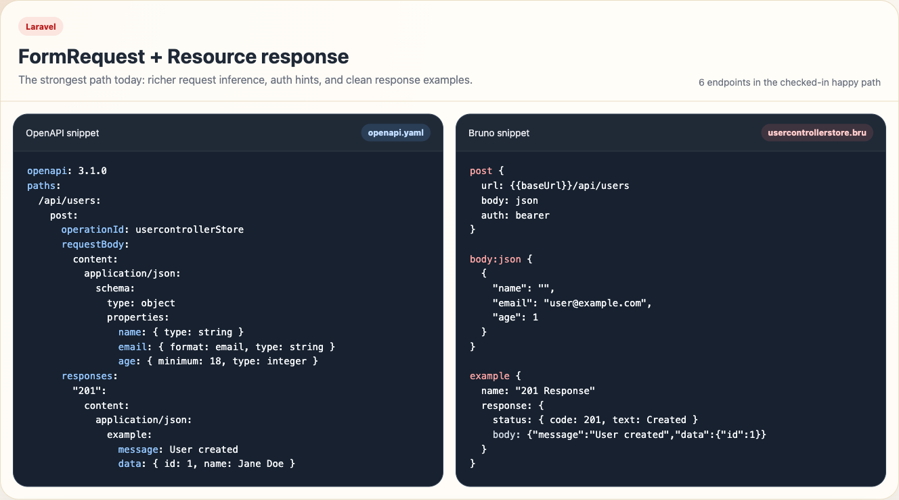
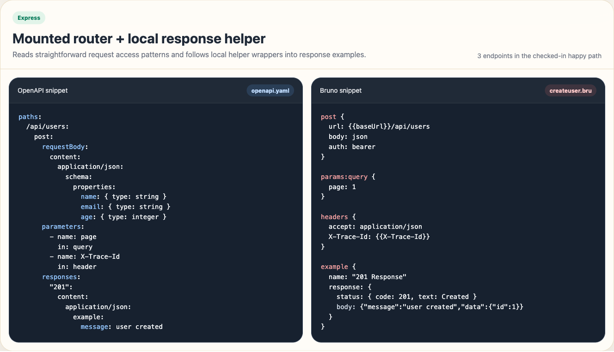
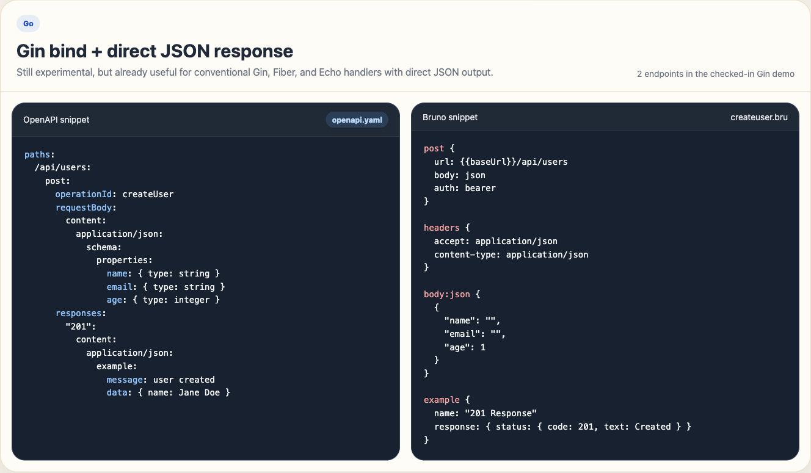

# brunogen

[](https://www.npmjs.com/package/brunogen)
[](https://nodejs.org/)
[](https://github.com/ryan-prayoga/brunogen/actions/workflows/ci.yml)

Brunogen scans a Laravel, Express.js, or Go API codebase, normalizes what it finds into OpenAPI, and emits a Bruno collection you can try immediately.

Laravel is the strongest path today, with materially richer request and response inference. Express.js and Go support are already usable for conventional codebases, but they remain more heuristic.

<table>
  <tr>
    <td align="center" valign="top">
      <strong>Laravel</strong><br />
      <a href="docs/assets/preview-laravel.png">
        
      </a><br />
      <sub>FormRequest + Resource response</sub><br />
      <sub><a href="docs/demo/laravel-happy-path/README.md">Open Laravel demo</a></sub>
    </td>
    <td align="center" valign="top">
      <strong>Express</strong><br />
      <a href="docs/assets/preview-express.png">
        
      </a><br />
      <sub>Mounted router + local response helper</sub><br />
      <sub><a href="docs/demo/express-happy-path/README.md">Open Express demo</a></sub>
    </td>
    <td align="center" valign="top">
      <strong>Go</strong><br />
      <a href="docs/assets/preview-go.png">
        
      </a><br />
      <sub>Gin bind + direct JSON response</sub><br />
      <sub><a href="docs/demo/go-happy-path/README.md">Open Go demo</a></sub>
    </td>
  </tr>
</table>

## Quick Start

Best first run: start with Laravel if you want the most complete inference path in under a minute.

```bash
npm i -g brunogen
brunogen init
brunogen generate
```

Default output:

- `.brunogen/openapi.yaml`
- `.brunogen/bruno/`

If you are testing from this repository checkout instead of an installed package, run `npm install`, `npm run build`, and `npm link` once from the repository root first.

## What You Get

- `openapi.yaml` generated directly from routes, handlers, controllers, and request/response patterns
- A ready-to-open Bruno collection under `.brunogen/bruno/`
- Warnings for patterns Brunogen could not infer confidently

## Framework Paths

| Framework | Current fit | First place to try | Demo |
| --- | --- | --- | --- |
| Laravel | Strongest path today | `cd tests/fixtures/laravel && brunogen init && brunogen generate` | [Laravel demo](docs/demo/laravel-happy-path/README.md) |
| Express | Useful, still heuristic | `cd tests/fixtures/express && brunogen init && brunogen generate` | [Express demo](docs/demo/express-happy-path/README.md) |
| Go | Experimental | `cd tests/fixtures/gin && brunogen init && brunogen generate` | [Go demo](docs/demo/go-happy-path/README.md) |

To refresh the checked-in demo snapshots after an intentional output change:

```bash
npm run demo:laravel
npm run demo:express
npm run demo:go
```

## Commands

- `init` creates a starter config in the current directory
- `generate` scans the current project and writes OpenAPI plus a Bruno collection
- `watch` regenerates when supported source files change
- `validate` checks generated OpenAPI output
- `doctor` shows environment and framework detection details

## Works Best Today

- Laravel route scanning from `routes/*.php`, including groups, prefixes, middleware hints, and `apiResource`
- Laravel request inference from FormRequest rules, inline validation, and common manual accessors such as `query`, `header`, typed accessors, `has`, `filled`, `safe()->only(...)`, and `enum(...)`
- Laravel response inference for direct arrays, `response()->json(...)`, `noContent()`, same-controller helpers, `JsonResource`, `->additional(...)`, and common abort/error/not-found paths
- Express scanning for mounted routers, straightforward request access patterns, and local response helpers
- Go Gin, Fiber, and Echo scanning for conventional route registration and direct JSON responses
- Bruno export with environments, baseline auth support, and native response `example {}` blocks

## How It Works

```text
source code
  -> framework adapter
  -> normalized endpoint model
  -> openapi.yaml
  -> Bruno collection
```

OpenAPI becomes the internal source of truth after scanning. Bruno is the output target.

## Read More

- [Detailed reference, examples, config, and support matrix](docs/reference.md)
- [CHANGELOG.md](CHANGELOG.md)
- [CONTRIBUTING.md](CONTRIBUTING.md)
- [docs/release-checklist.md](docs/release-checklist.md)
